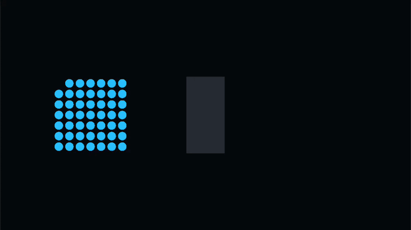
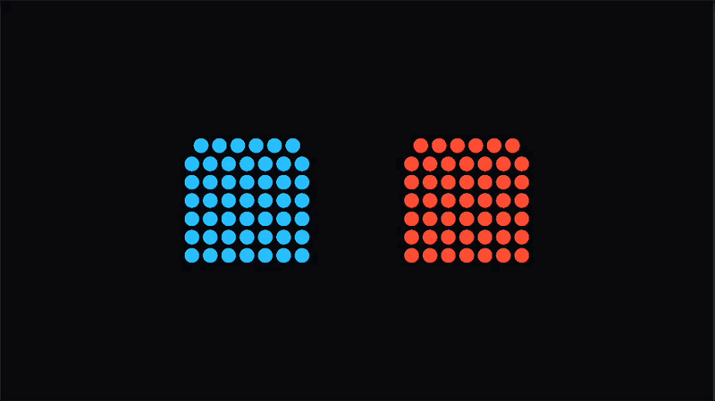

# Local Avoidance 2D

[English](README.md) | 日本語

Local Avoidance 2Dは、Burst/Jobsで多数の円形Agentを処理するUnity向けライブラリです。
Unity Physicsに依存しない2D crowd simulationを提供します。




## Features

- 予測的な速度回避
- Jacobi方式の重なり補正
- 円および線分（太さを持たせるとカプセル）Obstacle
- Agent/Obstacleレイヤー
- Agent単位の接触集約
- Persistent Nativeコンテナの再利用による定常フレームGC Alloc 0
- `Schedule`と同期用`Step`の共通パイプライン

## Usage

Package ManagerのSamplesタブから、対向流と矩形Obstacle回避の実行可能なサンプルをImportできます。

```csharp
const int agentCapacity = 10_000;
const int obstacleCapacity = 64;
const int agentIndex = 0;
const int activeAgentCount = 1;

using var simulation = new LocalAvoidanceSimulation(
    agentCapacity: agentCapacity,
    obstacleCapacity: obstacleCapacity,
    allocator: Allocator.Persistent);

var initialPosition = new float2(0f, 0f);
var desiredVelocity = new float2(2f, 0f);
const float agentRadius = .4f;

simulation.ActivateAgent(
    agentIndex: agentIndex,
    position: initialPosition,
    desiredVelocity: desiredVelocity,
    radius: agentRadius);

simulation.Schedule(
    deltaTime: deltaTime,
    agentCount: activeAgentCount,
    obstacleCount: 0).Complete();

var resolvedPosition = simulation.ResolvedPositions[agentIndex];
```

`agentIndex`はSimulation内の固定Slot番号です。`agentCount`は、Slot `0`から何個のSlotを
処理対象にするかを指定します。この例ではSlot `0`にある1体だけを処理します。

入力はSoAの`NativeArray`へ書き込み、`Schedule`後に結果バッファを読み取ります。

## Coordinate convention

Simulation自体にワールド平面設定はありません。
Simulation内部はワールド軸に依存しない`float2`です。
Gizmoだけは表示先が必要なため、`LocalAvoidanceGizmoSettings.Plane`で`XY / XZ`を選択できます。

## Lifetime

SimulationのJobが実行中に入力バッファを変更してはいけません。前回のHandleは次回の`Schedule`へ
内部的に連結されます。破棄時は未完了Jobを完了してからNativeメモリを解放します。

## Simulation capacity

```csharp
new LocalAvoidanceSimulation(
    agentCapacity: 10_000,
    obstacleCapacity: 64,
    allocator: Allocator.Persistent);
```

| 引数 | 内容 |
|---|---|
| `agentCapacity` | Simulationが保持できるAgentの最大数です。実行中には自動拡張されません。 |
| `obstacleCapacity` | 円・線分Obstacleを格納できる最大数です。0も指定できます。 |
| `allocator` | Nativeコンテナへ使用するAllocatorです。通常は`Allocator.Persistent`を指定します。 |

容量分のNativeメモリをコンストラクターで一度確保します。定常フレームで再確保しないことを
優先しているため、`Schedule`へCapacityを超える件数を渡すと`ArgumentOutOfRangeException`になります。

## LocalAvoidanceSettings

```csharp
simulation.Settings = LocalAvoidanceSettings.Default;
```

`Default`は一般的な初期値です。Agentの直径と移動速度に合わせて、主に`CellSize`と
`NeighborDistance`を調整してください。

| 設定 | 説明 |
|---|---|
| `CellSize` | 近傍検索に使用する空間グリッド1セルの大きさ |
| `NeighborDistance` | 周囲のAgentを近傍候補として探す距離 |
| `MaximumNeighbors` | Agentごとに保持して回避・接触計算へ使う近傍数の上限 |
| `MaximumCandidateChecks` | 近傍を選ぶために調べるグリッド内Agent数の上限 |
| `CollisionPredictionTime` | 何秒先の衝突まで予測して回避するか |
| `VelocityResponse` | 現在速度が計算後の目標速度へ追従する速さ |
| `SeparationSpeedRatio` | 近接Agentから離れる速度の強さ |
| `LateralSpeedRatio` | 前方のAgentやObstacleを横へ避ける速度の強さ |
| `LateralFlowFollowing` | 前方Agentの横方向の流れへ追従する割合 |
| `MinimumSpacingRatio` | Agent間で維持する最低距離の半径合計に対する比率 |
| `MaximumCorrectionRatio` | Solver 1反復で許可する位置補正距離の上限 |
| `SolverIterations` | 移動後の重なりとObstacle侵入を解消する反復回数 |
| `InnerLoopBatchCount` | 並列Jobで一度にWorkerへ割り当てるAgent数 |
| `ContactSlowdown` | 接触圧によって希望速度を減らす最大割合 |
| `ContactsForMaximumSlowdown` | 接触減速が最大になるAgent接触数 |
| `CorrectionVelocityInfluence` | 位置補正を次フレームの速度へ残す割合 |
| `ContactSkinRatio` | 接触数へ含めるために実半径へ加える余白 |
| `PreferredSeparationMultiplier` | 予測分離を開始する距離の半径合計に対する倍率 |
| `ContactRetentionSkinMultiplier` | 主要な接触拘束を保持する距離のContact Skinに対する倍率 |
| `DominantMassRatioThreshold` | 重い相手を主要な接触拘束として固定するMass比 |

### CellSize

```csharp
CellSize = 1.2f;
```

空間グリッド1セルの一辺の長さです。ワールド座標と同じ単位を使用します。

**パフォーマンスへの影響: 大。** 全Agentの近傍候補数と探索セル数を左右します。
小さくすれば常に軽くなるわけではなく、Agent密度と`NeighborDistance`との比率で最適値が変わります。

- 小さすぎると探索セル数が増える
- 大きすぎると1セル内の候補数が増える
- 目安は標準的なAgent直径の1.5～3倍
- 0以下の値は`0.01`へ補正される

Agent半径が`0.4`なら、`1.2`程度が開始値になります。

### NeighborDistance

```csharp
NeighborDistance = 1.2f;
```

速度回避で周囲のAgentを探す距離です。

**パフォーマンスへの影響: 大。** 探索距離がセル境界を越えると、各Agentが調べるセル数が段階的に
増加します。探索範囲は概ね`(2 * ceil(NeighborDistance / CellSize) + 1)^2`セルです。
また、`CellSize`未満へ設定しても内部で`CellSize`まで引き上げられるため、負荷は下がりません。

- 大きいほど早い段階から減速・回避する
- 大きすぎると不要な回避が増え、探索セル数も増える
- 小さすぎると速度回避が間に合わず、位置補正への依存が増える
- `CellSize`未満の値は`CellSize`へ補正される
- 目安は標準的なAgent直径の2～4倍

近傍候補は距離の近い順に最大10体まで処理します。この上限は密集時の処理時間を安定させるため、
現在はライブラリ内部で固定されています。

近傍の空間グリッド検索は1フレームに1回だけ行い、その結果を予測回避とすべてのSolver反復で
再利用します。Solverではキャッシュされたindexから補正後の距離を再計算します。そのため、
`NeighborDistance`は少なくとも最大Agent直径とContact Skinを含む距離以上に設定してください。
Solver中に新しく近傍へ入ったAgentは次フレームのキャッシュ更新で検出されます。

### MaximumNeighbors

```csharp
MaximumNeighbors = 8;
```

Agentごとに距離の近い順で保持し、回避と接触解決に使用する近傍数の上限です。

**パフォーマンスへの影響: 大。** 密集時は値を下げるほど、近傍の選別、回避計算、各Solver反復の
接触計算が減ります。一方、小さすぎると必要な接触相手が近傍キャッシュから外れ、重なりや
すり抜けが増える可能性があります。既定値は`8`、有効範囲は`1～10`です。`0`以下は既定値の`8`へ
補正されます。上限の`10`は内部の`FixedList128Bytes`が保持できる物理容量です。

### MaximumCandidateChecks

```csharp
MaximumCandidateChecks = 64;
```

近傍を選ぶために、空間グリッドからAgentごとに何体まで候補を調べるかを指定します。

`MaximumNeighbors`が最終的に保持する近傍数であるのに対し、`MaximumCandidateChecks`はその近傍を
選ぶ前に検査できる候補数です。密集した1セルに大量のAgentがいる場合でも、候補検査をこの件数で
打ち切ることで、1体あたりの処理時間が密度に比例して増え続けることを防ぎます。

- 小さくすると密集時の処理時間を抑えられる
- 小さすぎると必要な近傍を検査できず、密集や重なりが増える可能性がある
- `MaximumNeighbors`未満の値は`MaximumNeighbors`まで引き上げられる
- 0以下は既定値`64`へ補正される

`DirectControl`または`StableContactResolution`が有効なAgentは別枠で検査され、この上限を消費しません。

### CollisionPredictionTime

```csharp
CollisionPredictionTime = 0.5f;
```

何秒先の衝突まで予測して回避するかを指定します。

現在の速度を維持した場合に、AgentまたはObstacleへ接触するまでの時間を何秒先まで考慮するかを
指定します。単位は秒です。たとえば`0.5`なら、現在の相対速度のまま進むと0.5秒以内に接触する
対象に対して、前方減速と横回避を適用します。

接触までの予測時間は、表面間の距離を接近速度で割って求めます。

```text
衝突予測時間 = Agent同士の表面間距離 / 相対的な接近速度
```

値を大きくすると早い段階から回避し、小さくすると接触直前まで進行速度を維持します。停止中、
遠ざかっている相手、進行方向の側面または後方にいる相手は予測回避の対象になりません。

Agentを予測するには相手が`NeighborDistance`内にいる必要があります。Obstacleは`obstacleCount`件を
直接検査します。0以下は無効化ではなく既定値`0.5`へ補正されます。

高速な対向流では`NeighborDistance`も同時に広げてください。予測時間だけを増やしても検索範囲外の
Agentは検出できません。

### VelocityResponse

```csharp
VelocityResponse = 10f;
```

`CurrentVelocity`が計算された目標速度へ追従する速さです。単位は概ね1/秒です。

```text
小さい値：滑らかだが反応が遅い
大きい値：素早く反応するが、方向変化が鋭くなる
0       ：通常時はCurrentVelocityを維持
```

フレームレート非依存の指数補間に使用されます。ノックバックなどで`ImmediateVelocity[index] = 1`
を指定したフレームは、この値に関係なく即時反映します。

### SeparationSpeedRatio

```csharp
SeparationSpeedRatio = 0.4f;
```

希望速度に対して、近接Agentから離れる速度をどの程度加えるかを表します。

- `0`で予測的な分離速度を無効化
- 大きいほど密集前に強く離れる
- 大きすぎると群れが膨張し、細かい方向変化が増える
- 負の値は`0`へ補正される

`0.25～0.6`程度が一般的な調整範囲です。

### LateralSpeedRatio

```csharp
LateralSpeedRatio = 0.15f;
```

正面にAgentまたはObstacleがいる場合に加える横方向速度の比率です。Agent同士は進行方向に対して
同じ通行側を選びます。Segment Obstacleは近い端点側を選び、短時間保持して角での反転を抑えます。

- `0`で横回避を無効化し、主に減速する
- 大きいほど前方のAgentを積極的に回り込む
- 大きすぎると蛇行や群れの拡散が目立つ

`0.1～0.3`程度が開始値として適しています。

### LateralFlowFollowing

```csharp
LateralFlowFollowing = 0.65f;
```

同方向の前方Agentが持つ横速度へ後続が追従する割合です。先頭だけが回避して後続と衝突する現象を
抑えます。`0`で無効、`1`で前方Agentの横流れをそのまま加え、値は`0～1`へ制限されます。

### MinimumSpacingRatio

```csharp
MinimumSpacingRatio = 0.95f;
```

位置補正で維持しようとする最低距離の比率です。

```csharp
minimumDistance = (radiusA + radiusB) * MinimumSpacingRatio;
```

- `1.0`で半径合計と同じ距離を要求する
- `0.95`なら見た目上わずかな重なりを許容する
- 小さくすると密集しやすいが、補正負荷と振動を抑えられる
- 設定値は`0.01～1.0`へ制限される

大量のAgentが一点へ集まる場合、完全非重複の`1.0`より`0.9～0.98`の方が安定します。

### MaximumCorrectionRatio

```csharp
MaximumCorrectionRatio = 0.25f;
```

Solver 1反復でAgentを移動させられる最大距離を、そのAgent半径に対する比率で指定します。

```csharp
maximumCorrection = agentRadius * MaximumCorrectionRatio;
```

- 大きいほど重なりを速く解消する
- 大きすぎると密集時にAgentが暴れたり振動したりする
- 小さすぎると深い重なりの解消に複数フレーム必要になる
- 負の値は`0`へ補正される

通常は`0.15～0.35`程度を推奨します。

### SolverIterations

```csharp
SolverIterations = 2;
```

移動後に重なりとObstacle侵入を補正する反復回数です。

**パフォーマンスへの影響: 大。** 反復ごとに全Active AgentのConstraint処理が追加されます。

| 値 | 特性 |
|---:|---|
| 1 | 最軽量。密集時には重なりが残りやすい。 |
| 2 | 標準。性能と見た目のバランスを取る。 |
| 3～4 | より厳格だが、Job処理時間が増える。 |

設定値は`1～8`へ制限されます。反復ごとに全Active Agentを処理するため、負荷はほぼ反復数に比例します。

### InnerLoopBatchCount

```csharp
InnerLoopBatchCount = 128;
```

`IJobParallelFor.Schedule`へ渡すバッチサイズです。

**パフォーマンスへの影響: 中～大。** 処理量自体は変わりませんが、Agent密度によって1件ごとの
負荷が偏るため、値が大きすぎると一部のWorkerだけが長く動き、`Complete`の待機時間が増えます。

- 小さい値はワーカー間で分散しやすいが、Job管理コストが増える
- 大きい値は管理コストを抑えるが、ワーカー負荷が偏りやすい
- 最低値は`1`

端末のコア構成とAgent数によって最適値が異なるため、Profilerで比較してください。

### ContactSlowdown

```csharp
ContactSlowdown = 0.8f;
```

前フレームで周囲のAgentへ接触していた場合に、今回の`DesiredVelocity`を最大で何割減らすかを
`0～1`で指定します。`0.8`なら最大密集時にも希望速度の20%を残します。

- `0`で接触圧による減速を無効化
- 大きいほど密集中心への継続的な押し込みを抑える
- `1`では最大圧力時に希望速度が0になる
- 値は`0～1`へ制限される

### ContactsForMaximumSlowdown

```csharp
ContactsForMaximumSlowdown = 6f;
```

`ContactSlowdown`が最大になるAgent接触数です。

```csharp
pressure = saturate(agentContactCount / ContactsForMaximumSlowdown);
desiredVelocity *= 1 - pressure * ContactSlowdown;
```

小さくすると数体との接触だけで強く減速し、大きくすると高密度になるまで速度を維持します。
最低値は`1`です。

### CorrectionVelocityInfluence

```csharp
CorrectionVelocityInfluence = 0.15f;
```

Solverによる位置補正を、次フレームへ持ち越す速度へ変換する割合です。

```csharp
velocity += correction / deltaTime * CorrectionVelocityInfluence;
```

- `0`で速度への反映を無効化
- 大きいほど密集中心から外へ流れる動きを維持する
- 大きすぎると弾ける、振動する、移動速度が過大になる可能性がある
- `0.1～0.2`程度を開始値として推奨
- 負の値は`0`へ補正される

補正は各Solver反復で加算されます。そのため、反復数を増やす場合はこの値も実機で再調整してください。

### ContactSkinRatio

```csharp
ContactSkinRatio = 0.1f;
```

実際に重なる直前のAgentを、密集圧の計算上は接触として数える余白です。半径合計に対する比率で指定します。

```csharp
contactDistance = minimumDistance +
                  (radiusA + radiusB) * ContactSkinRatio;
```

- `0`では実際に最低間隔を下回ったAgentだけを数える
- 正の値では、ほぼ接触しているAgentも`AgentContactCount`へ含める
- 位置補正は実際に最低間隔を下回った場合だけ行う
- 大きすぎると接触していない群れまで減速する
- `0.05～0.15`程度を推奨

これにより、Solverが重なりを一時的に解消した直後に接触数が0へ戻り、再加速する現象を抑えます。

### PreferredSeparationMultiplier

予測分離を始める距離をAgent半径合計に対する倍率で指定します。既定値は`1.2`、最低値は`1`です。
大きくすると早く群れが広がります。0以下は部分初期化との互換性のため既定値へ補正されます。

### ContactRetentionSkinMultiplier

Agentの移動を最も強く制限している接触拘束を保持する際、Contact Skinを何倍まで広げるかを指定します。既定値は`2`、最低値は
`1`です。小さすぎると拘束相手が頻繁に切り替わり、大きすぎると既に離れた相手を保持し続けます。

### DominantMassRatioThreshold

相手をAgentの移動を最も強く制限する接触として扱うMass比です。既定値は`4`、最低値は`1`です。相手Massが自身Massの
この倍率以上なら、回避・接触拘束で相手を動かしにくい対象として安定保持します。

## Agent input buffers

| バッファ | 内容 |
|---|---|
| `Positions` | フレーム開始時の中心位置です。 |
| `DesiredVelocities` | 回避計算前に、Agentをどの方向へどの速さで移動させたいかを表す速度ベクトルです。 |
| `CurrentVelocities` | 前フレームの解決済み速度です。速度平滑化に使用します。 |
| `Radii` | 円形Agentの半径です。0より大きい値を設定してください。 |
| `Masses` | 補正配分と、移動を最も強く制限する接触の判定に使う押されにくさです。標準値は`1`です。 |
| `AvoidancePriorities` | 高いAgentは低いAgentへの予測回避を省略し、接触補正では優先されます。 |
| `AvoidanceWeights` | 予測回避の強度です。`0`なら直進、`1`なら標準回避です。 |
| `CorrectionVelocityWeights` | 位置補正を次フレーム速度へ残すAgent単位の倍率です。 |
| `MaximumCorrectionSpeeds` | 位置補正速度の上限です。`0`なら無制限です。 |
| `Layers` | Agent自身が所属する32bitレイヤーです。 |
| `CollisionMasks` | 回避・接触対象として認識するレイヤーマスクです。 |
| `ContactEventMasks` | Enter/Exit接触イベントを収集する相手レイヤーです。衝突応答には影響しません。 |
| `Active` | `1`なら処理対象、`0`なら無視します。 |
| `ImmediateVelocity` | `1`なら速度平滑化をせず、今回の計算速度を即時反映します。 |
| `DirectControl` | 予測回避と接触減速を無効化し、入力速度を優先します。非貫通制約は残ります。 |
| `StableContactResolution` | 接触法線の合算ではなく、決定論的な最深接触を拘束に使用します。 |

### Layers

`Layers`はAgentが所属するレイヤー、`CollisionMasks`はそのAgentが回避・接触対象として認識する
レイヤーを表します。Agent同士を回避・接触計算の対象にするには、双方が相手のレイヤーを許可して
いる必要があります。

```csharp
(agentA.CollisionMask & agentB.Layer) != 0 &&
(agentB.CollisionMask & agentA.Layer) != 0
```

たとえばAがBを対象にしていても、BがAを対象外にしていれば、両者の回避・接触計算は行われません。
`ContactEventMasks`はこの判定とは別に、接触Enter/Exitイベントを収集する相手だけを指定します。

未使用slotは必ず`Active = 0`にしてください。ライブラリは毎フレームActive配列を自動クリアしません。

### Masses

Massは重なり補正をAgent間でどう配分するかと、移動を最も強く制限する接触拘束の判定に使用します。剛体のように
加速度を計算する値ではありませんが、補正速度の保持や拘束相手の選択を通じて解決速度へ間接的に
影響します。

```text
Mass 0.5  軽く、押されやすい
Mass 1.0  標準
Mass 3.0  標準の3倍押されにくい
```

補正割合は内部で逆質量から計算します。

```csharp
inverseMassA = 1 / massA;
shareA = inverseMassA / (inverseMassA + inverseMassB);
```

同じMassなら従来どおり双方が半分ずつ補正されます。`Mass A = 1`、`Mass B = 3`なら、
Aが重なり量の75%、Bが25%移動します。0以下の値は計算時に`0.0001`として扱います。
完全に動かない物体は非常に大きなMassのAgentではなくObstacleとして登録してください。

相手とのMass比が`DominantMassRatioThreshold`以上なら、その相手をAgentの移動を最も強く制限する接触として保持します。
これは密集中に主要な拘束法線がフレームごとに切り替わる現象を抑えるためのもので、単純な補正割合
だけではありません。

### AvoidanceWeights

Agentごとの予測回避強度です。Simulation全体の`SeparationSpeedRatio`と`LateralSpeedRatio`へ
掛け合わせて使用します。

| 値 | 動作 |
|---:|---|
| `0` | 予測回避と前方減速を行わず、DesiredVelocityへ直進する。接触後のMass補正は有効。 |
| `0.25` | 弱く回避し、基本的には目的方向を優先する。 |
| `1` | 標準的な予測回避を行う。 |
| `2` | 分離・横回避を強める。前方減速自体は標準強度が上限。 |

実装上の上限はありません。ただし前方減速への適用は`1`で飽和し、`1`を超える値は分離速度、
横回避、横流れ追従をさらに増幅します。過剰な蛇行や振動を避けるため、通常の調整範囲は`0～2`を
推奨します。負の値は`0`として扱います。すべて`1`なら標準の予測回避特性になります。
オートパイロットなど詰まりを避けたいAgentは`1`、目的への直進を優先する敵は`0.1～0.3`が開始値です。

## Teleport

実行中のAgentを通常の移動計算を介さず、別の位置へ移すためのAPIです。

```csharp
simulation.Teleport(agentIndex, new float2(x, y));
```

位置系バッファを同期し、既定では速度、接触拘束、Obstacle回避方向をリセットします。
未完了のSimulation Jobがある場合は内部で完了してから書き換えるため、フレーム中に多数のAgentを
ワープさせる場合はJob完了後にまとめて呼び出してください。速度を維持する場合は
`resetVelocity: false`を指定します。

## Obstacles

### Circle

```csharp
obstacles[0] = Obstacle.Circle(
    position,
    radius,
    layer,
    collidesWith);
```

柱、岩、木など、速度やMassを持たない固定形状を表します。`position`が中心位置になります。

### Segment / Capsule

```csharp
obstacles[0] = Obstacle.Segment(
    pointA,
    pointB,
    radius,
    layer,
    collidesWith);
```

`PointA`から`PointB`までの有限の壁です。`radius = 0`なら線分、正の値なら厚みを持つ
カプセル状の壁として扱います。半径は負の場合`0`へ補正されます。

Agentが`CollisionPredictionTime`以内にObstacleへ接近すると、接触前に減速と横回避を行います。
Segmentでは近い端点側、Circleでは現在の偏り側を選択します。選択した側は予測時間に短い余白を
加えた期間保持し、角付近で回避方向が反転する現象を抑えます。予測が間に合わない場合も、移動後の
非貫通制約がAgentをObstacle表面へ戻します。

Obstacleとのレイヤー判定も双方のMaskを確認します。

```csharp
(agent.CollisionMask & obstacle.Layer) != 0 &&
(obstacle.CollidesWith & agent.Layer) != 0
```

現在の`0.1.0`では、指定されたObstacleを各Active Agentが順番に確認します。そのため、多数のObstacleを
登録した場合の負荷は`Agent数 × Obstacle数`に比例します。少数のプレイヤー・壁で利用し、複雑なマップを
大量の線分へ分割する用途は、Obstacle用空間グリッドを導入する版まで避けてください。

## Schedule / Step parameters

```csharp
JobHandle handle = simulation.Schedule(
    deltaTime,
    agentCount,
    obstacleCount,
    dependency);
```

| 引数 | 内容 |
|---|---|
| `deltaTime` | 位置積分に使用する秒単位の経過時間です。0以下の場合は処理せず既定Handleを返します。 |
| `agentCount` | バッファ先頭から検査するslot数です。Active数そのものではありません。 |
| `obstacleCount` | `Obstacles`バッファ先頭から使用する件数です。 |
| `dependency` | 入力バッファを生成したJobなど、先に完了すべきJobHandleです。 |

`Schedule`は最終JobHandleを返し、内部では不要な`Complete`を行いません。前回このSimulationから返したHandleも
自動的に依存関係へ含めます。

```csharp
simulation.Step(deltaTime, agentCount, obstacleCount);
```

確保したすべてのSlotを処理対象にする場合は、Capacityを使用する次のOverloadを利用できます。

```csharp
simulation.Step(deltaTime);
JobHandle handle = simulation.Schedule(deltaTime);
```

非ActiveのAgent Slotは処理を省略します。引数を省略するOverloadは`ObstacleCapacity`までの全Obstacle
Slotを検査するため、確保容量より使用件数が少ない場合は件数を指定するOverloadを使用してください。

`Step`は`Schedule(...).Complete()`を行う同期用APIです。計算結果は同一です。

## Output buffers

| バッファ | 内容 |
|---|---|
| `ResolvedPositions` | 回避、移動、重なり補正、Obstacle制約後の位置です。 |
| `MovedPositions` | 速度積分と最初のObstacle制約後、Agent間Solver適用前の位置です。 |
| `ResolvedVelocities` | 回避とObstacle法線を反映した速度です。 |
| `Contacts` | Agentごとに集約した接触状態です。 |
| `EnteredContacts` | 今回新たに接触した、イベント対象Agentペアです。 |
| `ExitedContacts` | 今回接触を終了した、イベント対象Agentペアです。 |

## AgentContactState

| フィールド | 内容 |
|---|---|
| `AgentContactCount` | 最終Solver反復でContact Skin内にいる近傍Agent数です。 |
| `ObstacleContactCount` | 最終Solver反復で接触したObstacle数です。 |
| `BlockingAgentContactCount` | 自身と同等以上のAvoidance Priorityを持ち、希望進行方向の前方に接触しているAgent数です。 |
| `ForwardPenetrationPressure` | 進行方向にある接触の最大侵入率です。半径合計の25%侵入すると`1`になります。 |
| `Priority0ContactCount`～`Priority2ContactCount` | Avoidance Priority別のAgent接触数です。 |
| `CombinedNormal` | 接触法線の合計です。必要なら利用側でnormalizeします。 |
| `ConstraintNormal` / `AllowedNormalSpeed` | 次フレームへ保持する主要な非貫通拘束です。 |
| `ConstraintAgentIndex` | 主要な接触拘束として選ばれた相手AgentのSlot番号です。有効性は`HasConstraint`で判定します。 |
| `ConstraintOtherMass` / `ConstraintOtherRadius` | 選択された拘束相手の情報です。 |
| `ConstraintPenetration` | 選択された拘束相手との侵入距離です。 |
| `CorrectionLimit` | 最終Solver反復でこのAgentへ適用できた位置補正距離の上限です。 |
| `HasConstraint` | 次フレームへ保持する主要な非貫通拘束があれば`1`です。 |
| `ConstraintBlocksMovement` | `ConstraintAgentIndex`で示される代表接触相手が、このAgentの速度を拘束できる場合は`1`です。 |
| `ConstraintIsDominant` | Mass比により、移動を最も強く制限する接触として選択されていれば`1`です。 |
| `IsTouching` | AgentまたはObstacleへ接触していれば`1`です。 |

接触情報は集約値であり、全接触ペアの一覧ではありません。ダメージ、効果音、ゲームイベントは利用側で処理します。
`AgentContactCount`には`ContactSkinRatio`内の近接Agentも含まれるため、厳密な衝突イベントではなく
密集状態の指標として扱ってください。

## Agent Raycast

```csharp
int count = simulation.Raycast(
    origin, direction, distance, capsuleRadius,
    queryLayer, queryCollisionMask, results);
```

現在のAgent位置に対する非Allocのswept-circle queryです。結果は距離順で、最大件数は呼び出し側が
渡す`NativeArray<RaycastHit>`の長さです。検索前に未完了のSimulation Jobを完了します。
対象判定は`queryCollisionMask & agent.Layer`と`agent.CollisionMask & queryLayer`の双方を確認します。
Obstacleは検索対象に含みません。

## Recommended tuning order

1. `CellSize`を標準Agent直径の1.5～3倍にする
2. `NeighborDistance`を直径の2～4倍にする
3. `MinimumSpacingRatio = 0.95`、`SolverIterations = 2`から開始する
4. Agentごとの`Masses`と`AvoidanceWeights`を設定する
5. 密集中心へ押し込み続ける場合は`ContactSlowdown`を調整する
6. 外向きの流れがすぐ消える場合は`CorrectionVelocityInfluence`を少し上げる
7. 重なりが目立つ場合は`MaximumCorrectionRatio`を少し上げる
8. Agentが暴れる場合は`MaximumCorrectionRatio`を下げ、それでも収まらなければ`CorrectionVelocityInfluence`を下げる
9. 正面で詰まりすぎる場合は`LateralSpeedRatio`を上げる

## Scope

本パッケージは剛体物理、摩擦、反発、Joint、経路探索を提供しません。`Raycast`は登録済みAgentに
対する非Allocの2D ray/capsule queryだけを提供し、Obstacleや任意Colliderは検索しません。
大量の円形Agentの移動・回避・侵入防止に責務を限定します。

## Installation
Git Path (Unity Package Manager)
> ```https://github.com/kurobon-jp/LocalAvoidance2D.git?path=Packages/com.github.kurobon.local-avoidance-2d/```